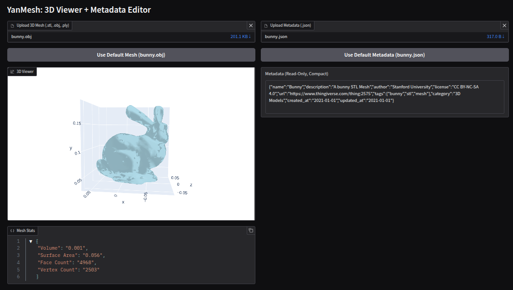

# YanMesh — 3D Viewer + Metadata Inspector


*YanMesh — 3D mesh and metadata inspection app*

---

YanMesh is an interactive Gradio-based web application designed to visualize and inspect 3D mesh files (`.stl`, `.obj`, `.ply`) alongside structured metadata stored in JSON format.

## Features

| Feature                | Description                                                      |
|------------------------|------------------------------------------------------------------|
| 🧱 Mesh Upload         | Upload `.stl`, `.obj`, or `.ply` mesh files                      |
| 🖼️ 3D Mesh Viewer      | Live interactive viewer using Plotly (works for all supported formats) |
| 📥 Metadata Upload     | Upload JSON file with custom metadata                            |
| 📊 Mesh Statistics     | Volume, surface area, number of faces, vertex count              |
| 📤 Default Data        | Buttons to load default mesh (`bunny.obj`) and metadata (`bunny.json`) |
| 📐 Responsive Layout   | Organized using Gradio Blocks, Row, and Column                   |
| 📝 Metadata Inspector  | Metadata is shown as a compact, read-only JSON string            |

## How it Works

- **No data is loaded automatically.**
- Users can **upload a mesh** or click a button to load the default mesh (`bunny.obj`).
- The mesh is visualized using Plotly for robust, interactive 3D viewing.
- Mesh statistics (volume, surface area, face count, vertex count) are shown. If no mesh is loaded, an error message is displayed.
- Users can **upload a metadata JSON** or click a button to load the default metadata (`bunny.json`).
- Metadata is displayed as a compact, read-only JSON string (no editing or download).

## Tech Stack
- [Gradio](https://gradio.app/) — for the UI
- [trimesh](https://trimsh.org/) — for mesh parsing and statistics
- [plotly](https://plotly.com/python/) — for 3D mesh visualization
- Python standard libraries: `json`, `logging`

## Installation

1. **Clone the repository:**
   ```bash
   git clone https://github.com/elhou-ysy/YanMesh.git
   cd YanMesh
   ```
2. **Create a virtual environment (recommended):**
   ```bash
   python3 -m venv .venv
   source .venv/bin/activate
   ```
3. **Install dependencies:**
   ```bash
   pip install -r requirements.txt
   ```
   Or use the Makefile:
   ```bash
   make install
   ```

## Makefile Commands

You can use the following `make` commands for convenience:

| Command   | Description                                                      |
|-----------|------------------------------------------------------------------|
| `make setup`   | Creates a new virtual environment and installs dependencies   |
| `make venv`    | Removes any existing `.venv` and creates a new virtual environment |
| `make install` | Installs Python dependencies from `requirements.txt`         |
| `make run`     | Runs the YanMesh app using the virtual environment           |
| `make clean`   | Removes the virtual environment and all `__pycache__` folders |

## Usage

Run YanMesh using the Makefile or directly with Python:

```bash
make run
```

Or:

```bash
python yanmesh.py
```

This will launch a local Gradio web server. Open the provided URL in your browser to use the app.

## Supported Mesh Formats
- `.stl`, `.obj`, `.ply` (other formats may not display correctly)

## Notes
- **No data is loaded by default.** Use the provided buttons to load the default mesh/metadata, or upload your own files.
- **Mesh stats** include volume, surface area, face count, and vertex count. If no mesh is loaded, an error message is shown.
- **Metadata** is shown as a compact, read-only JSON string. There is no editing or download feature.
